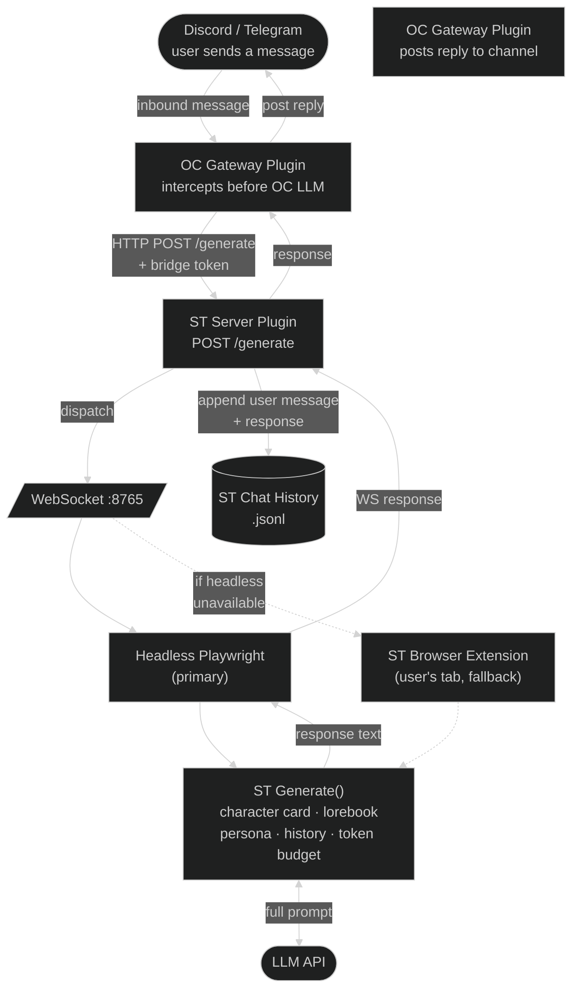

# Architecture

openclaw-bridge is not a single program. It is a set of components that work together across two separate applications (SillyTavern and OpenClaw) and a browser. Understanding what each piece is and why it exists makes the rest of the documentation much easier to follow.

---

## Components

| Component | What it is | Where it lives |
|---|---|---|
| **ST server plugin** | Node.js module loaded by SillyTavern at startup | `SillyTavern/plugins/openclaw-bridge/` |
| **ST browser extension** | JavaScript loaded in your ST browser tab | `SillyTavern/public/scripts/extensions/openclaw-bridge/` |
| **Headless Playwright service** | Background Chromium browser managed by the plugin | Launched automatically by the ST plugin |
| **OC gateway plugin** | TypeScript module loaded by OpenClaw | `~/.openclaw/extensions/openclaw-bridge/` |
| **character-bridge skill** | Skill definition installed per character agent | `~/.openclaw/workspace-{name}/skills/character-bridge/` |
| **character-links.json** | Config file linking ST characters to OC agents | `data/openclaw-bridge/character-links.json` |
| **Bridge token** | Shared auth secret | `data/openclaw-bridge/bridge-token.txt` |

### ST server plugin

Runs inside SillyTavern's Node.js process. It exposes an HTTP API that OpenClaw calls when a message arrives on any channel. It manages the WebSocket connection to the browser extension, coordinates generation requests, and writes messages to ST's chat history files.

### ST browser extension

Runs inside a browser tab that has SillyTavern loaded. It is the only component with access to ST's internal `Generate()` function, which is what actually calls the LLM. When the plugin receives a message, it forwards it to the extension over WebSocket; the extension calls `Generate()` and returns the response.

This is not an arbitrary design choice — ST's `Generate()` is only accessible from the browser context and it handles the full prompt pipeline (character card, lorebooks, author's notes, persona, token budgeting) automatically. Running generation anywhere else would require reimplementing all of that.

### Headless Playwright service

A Chromium browser process that the plugin launches automatically when SillyTavern starts. It loads ST in a background tab and runs the extension there, so generation works 24/7 without the user keeping a browser tab open. When a generation request arrives, the plugin always prefers the headless service over the user's browser tab.

### OC gateway plugin

Intercepts every inbound message that arrives at the OpenClaw gateway before OC's own LLM processes it. Instead of letting OC respond directly, it calls the ST plugin's `/generate` endpoint and delivers ST's response back to the channel. The user's characters always speak through SillyTavern.

### character-bridge skill

A YAML + Markdown skill definition installed into each OC agent's workspace. It defines the `generate_response` and `log_action` tool schemas and provides the agent's operating instructions. The OC gateway plugin uses it to know how to call ST.

### character-links.json

Persists the mapping between ST character names and OC agent IDs. Also stores owner user IDs (for trust labels), heartbeat configuration, and whether each character is currently active. Shared between the ST plugin and OC plugin via a symlink created by `setup.sh`.

### Bridge token

A random 32-byte hex secret generated by `setup.sh`. Every HTTP call from OC to the ST plugin must include it as a Bearer token. It is the only authentication mechanism between the two systems.

---

## How a message travels through the system

---

## Trust labels

Every message arrives with a `user_id` in `platform:id` format (e.g. `discord:123456789`). Before generation, the ST plugin checks `character-links.json` to see if that user ID is in the character's `owner_user_ids` list:

- **`[OWNER]`** — the message sender is a configured owner. The generated response may include outbound actions (e.g. `discord_post`, `openclaw_write_memory`).
- **`[GUEST]`** — everyone else. Actions are stripped from the response before it is returned to OC.

The label is injected by code before generation and cannot be influenced by message content.

---

## Heartbeat (autonomous presence)

The OC gateway plugin runs a polling loop every 60 seconds per character. When a scheduled interval elapses (default: 2 hours) or a conversation has been idle long enough, it sends a `/generate` request with `is_heartbeat: true`. The ST plugin recognises this, skips the trust-label logic, and allows actions in the response regardless of sender. The generated response is logged as a system entry in the character's ST chat history.

See [Adding a character — Heartbeat](adding-a-character.md#heartbeat--autonomous-presence) for configuration.

---

## Character memory (lorebook writes)

During generation, a character can call the `openclaw_write_memory` tool to persist a fact to a per-character lorebook (`{name}-auto-memory.json`). This is processed by the ST plugin synchronously before returning to OC, so the memory is written before the next generation begins. On subsequent requests, SillyTavern injects matching lorebook entries automatically.

See [Adding a character — Memory](adding-a-character.md#character-memory) for setup.

---

## Key design constraints

**Generation must happen in the browser.** ST's `Generate()` is only accessible from `SillyTavern.getContext()` inside a browser tab. The plugin cannot call it server-side. The WebSocket round-trip exists because of this constraint, not despite it.

**History writes are explicit and separate.** `Generate('quiet', ...)` returns text without writing to chat history or touching the UI. The plugin writes the user message and the response to the chat file explicitly after generation. This is what makes it possible for a Discord conversation to appear in ST's chat UI.

**The headless service is always preferred.** The user's browser tab is a fallback, never the primary generation client. Messages arriving at 3am are handled by the headless service without waking up anyone's browser.

**No intermediary process.** OC calls the ST plugin directly over HTTP. There is no Python bridge, no adapter layer, no message queue.
