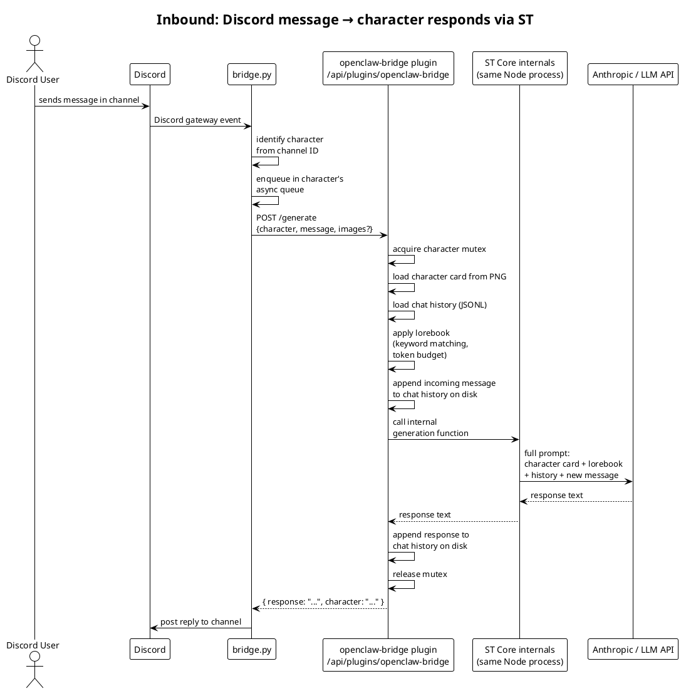
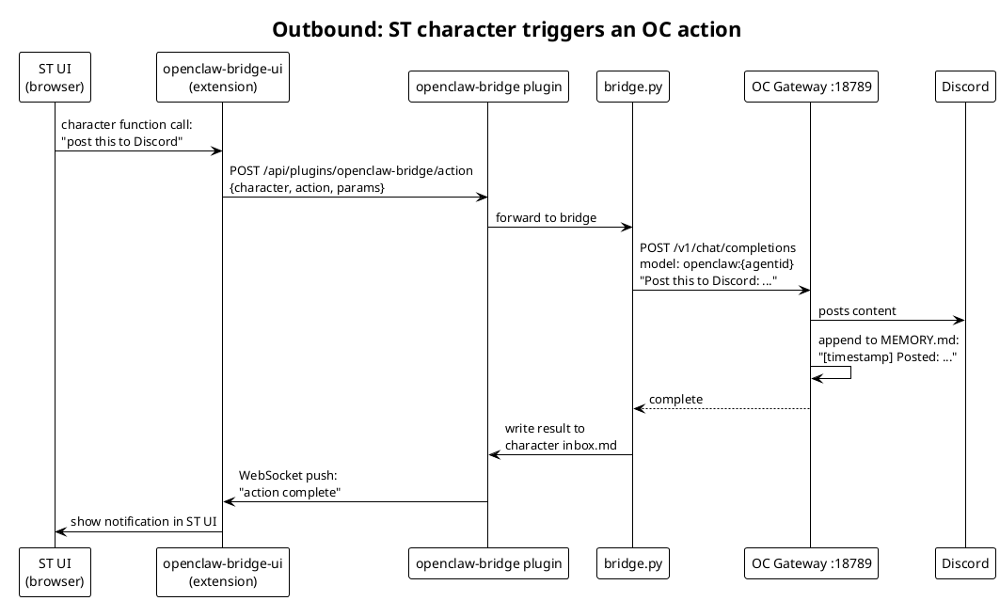
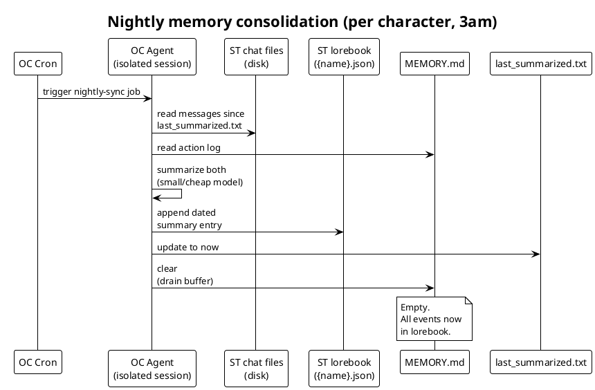
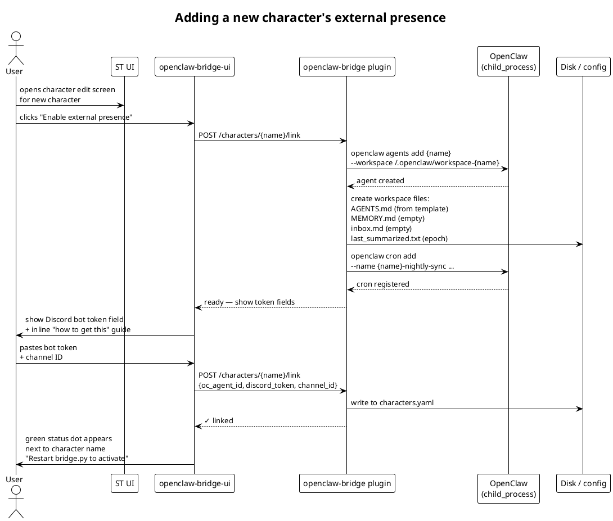

# SillyTavern + OpenClaw Bridge — Technical Plan

## Overview

SillyTavern (ST) is the brain: canonical character identity, lorebooks, chat history, prompt assembly, LLM calls. OpenClaw (OC) is the body: Discord, WhatsApp, autonomous scheduled actions, always-on presence. A custom ST server plugin (`openclaw-bridge`) exposes the API that makes ST driveable from OC. The bridge (`bridge.py`, Python) routes between them. Together they give any character a persistent, multi-channel presence with 100% ST fidelity — no degraded copies, no SOUL.md approximations.

---

## Architecture

```
┌─────────────────────────────────────────────────────────────────┐
│                      SillyTavern (Node.js)                      │
│                                                                 │
│  ┌────────────────────┐   ┌───────────────────────────────┐    │
│  │   ST Core          │   │   openclaw-bridge plugin       │    │
│  │  (characters,      │◄──│   /api/plugins/openclaw-bridge │    │
│  │   lorebooks,       │   │                               │    │
│  │   chat history,    │   │  POST /generate               │    │
│  │   LLM pipeline)    │   │  GET  /characters             │    │
│  └────────────────────┘   │  POST /characters/:name/link  │    │
│                           │  DELETE /characters/:name/link│    │
│  ┌────────────────────┐   │  GET  /status                 │    │
│  │   ST UI (browser)  │◄──│  WS   :8765                   │    │
│  │  + openclaw-bridge │   └───────────────────────────────┘    │
│  │    UI extension    │                                         │
│  └────────────────────┘                                         │
└────────────────────────────────┬────────────────────────────────┘
                                 │ HTTP + WebSocket (localhost only)
                                 ▼
┌─────────────────────────────────────────────────────────────────┐
│                         bridge.py (Python)                      │
│                                                                 │
│  - Character registry (characters.yaml)                         │
│  - Per-character async message queues                           │
│  - Image attachment handling (Discord CDN → base64)             │
│  - OC gateway HTTP client                                       │
│  - Discord adapter (one bot token per character)                │
│  - WhatsApp adapter (future)                                    │
└────────────────────────────────┬────────────────────────────────┘
                                 │ HTTP (OpenAI-compatible)
                                 │ localhost:18789
                                 ▼
┌─────────────────────────────────────────────────────────────────┐
│                       OpenClaw Gateway                          │
│                                                                 │
│  Agent: gerard          Agent: edward         Agent: ...        │
│  ~/.openclaw/           ~/.openclaw/           ~/.openclaw/     │
│  workspace-gerard/      workspace-edward/      workspace-.../   │
│    MEMORY.md              MEMORY.md              MEMORY.md      │
│    inbox.md               inbox.md               inbox.md       │
│    last_summarized.txt    last_summarized.txt    ...            │
│                                                                 │
│  - Discord bot(s)         (each character's bot bound here)     │
│  - Cron scheduler         (autonomous actions + nightly sync)   │
└─────────────────────────────────────────────────────────────────┘
```

---

## Components

### 1. ST Server Plugin (`openclaw-bridge`)

Lives in `SillyTavern/plugins/openclaw-bridge/`. Runs inside ST's Node.js process — same process, same memory space, direct access to ST's internal modules.

**Endpoints exposed:**

```
POST /api/plugins/openclaw-bridge/generate
  Body: {
    character: "Gerard",          // exact ST character name
    message: "What do you think?",
    images: ["data:image/jpeg;base64,..."],  // optional, for vision
    channel: "discord",
    user_id: "discord:123456789"
  }
  Returns: { response: "...", character: "Gerard" }

GET  /api/plugins/openclaw-bridge/characters
  Returns: all ST characters, flagged if linked to OC

POST /api/plugins/openclaw-bridge/characters/:name/link
  Body: { oc_agent_id: "gerard", discord_channel_id: "..." }

DELETE /api/plugins/openclaw-bridge/characters/:name/link

GET  /api/plugins/openclaw-bridge/status
  Returns: { plugin_version, connected_clients, active_sessions }

WebSocket: ws://localhost:8765
  - Pushes inbound notifications to ST UI extension
  - Receives outbound action requests from UI extension
```

**How `/generate` works internally:**

The plugin runs inside ST's Node.js process and can call ST's internals directly. For each `/generate` call:

1. Load the character's data from `data/default-user/characters/{name}.png` (PNG with embedded JSON in `tEXt/chara` chunk, base64-encoded TavernAI V2 format)
2. Load the character's active chat file from `data/default-user/chats/{name}/`
3. Load and apply active lorebook entries (keyword matching, insertion depth, token budget)
4. Append the incoming message to the chat history
5. Call ST's internal generation function with the full assembled context
6. Receive the response
7. Append the response to chat history on disk
8. Return the response text to the caller

**Per-character session isolation:**

The plugin holds a `Map<characterName, CharacterSession>` in memory. Each session is independent — Gerard responding on Discord does not interfere with user's active ST conversation with Edward. Each session has a mutex so concurrent calls for the same character queue rather than race.

**Plugin file structure:**
```
plugins/openclaw-bridge/
├── package.json
├── index.js              # entry point, registers all routes
├── generator.js          # wraps ST's internal generation
├── character-loader.js   # reads character cards, lorebooks, chat files
├── session-manager.js    # per-character sessions and mutexes
├── ws-server.js          # WebSocket for UI extension communication
└── config.js             # reads plugin config file
```

---

### 2. ST UI Extension (`openclaw-bridge-ui`)

Lives in `SillyTavern/public/scripts/extensions/third-party/openclaw-bridge-ui/`.

Communicates with the server plugin via `/api/plugins/openclaw-bridge/...` — this is the intended pattern for ST plugin+extension pairs.

**What it adds to the ST interface:**

A "External Presence" panel inside the character editing screen (where users already edit character cards). For each character it shows:

- **Toggle:** Enable external presence on OpenClaw
- **Status badge:** Connected / Disconnected / Not configured
- **Discord bot token field** (password-masked input with paste button)
- **Discord channel ID field** (with a "How to find this" inline tip)
- **"Test connection" button** — sends a test message through the full pipeline and shows the response
- **"Sync to OpenClaw" button** — re-exports character config if user made card changes

A small indicator also appears in the main character list: a green dot next to characters that are active on OC.

When user enables external presence on a new character, the plugin handles everything behind the scenes:
- Calls `openclaw agents add {name}` via Node.js `child_process`
- Creates the workspace directory and files (`MEMORY.md`, `inbox.md`, `last_summarized.txt`)
- Registers the nightly summarization cron job in OC
- Saves the Discord token and channel ID to the character's config entry
- Writes to `characters.yaml` for the bridge to pick up

User never needs to touch a terminal for character management. The one manual step you can't avoid is creating the Discord bot in Discord's developer portal — but the extension shows step-by-step instructions inline when user clicks "How do I get a bot token?".

**Notification area:**

A small collapsible panel (bottom of ST sidebar) shows recent activity:
- "Gerard responded on Discord — 2 minutes ago"
- "Edward posted autonomously — 1 hour ago"

Clicking an entry shows what was said.

---

### 3. Bridge (`bridge.py`, Python)

Routing layer between external channels and the ST plugin.

**Responsibilities:**
- Maintain Discord bot connections (one per active character)
- Receive Discord messages, identify the character from channel ID
- Enqueue in the correct character's `asyncio.Queue`
- Per-character worker coroutine processes one message at a time
- Download Discord image attachments, base64-encode, include in `/generate` call
- POST to ST plugin, receive response, send back to Discord
- Receive OC action completions, write to character inbox files

**Character registry (`characters.yaml`):**

```yaml
characters:
  Gerard:                                  # must match exact ST character name
    oc_agent_id: "gerard"                  # OC agent ID (lowercase, no spaces)
    discord_channel_id: "123456789012345"
    discord_bot_token: "Bot TOKEN_HERE"
    whatsapp_number: null                  # future
    active: true

  Edward:
    oc_agent_id: "edward"
    discord_channel_id: "987654321098765"
    discord_bot_token: "Bot OTHER_TOKEN"
    whatsapp_number: null
    active: true
```

**Per-character queue pattern:**

```python
async def character_worker(char_name: str, queue: asyncio.Queue):
    """One worker per character — serializes all incoming messages."""
    while True:
        job = await queue.get()
        try:
            response = await post_to_st_plugin(char_name, job)
            await send_to_discord(char_name, response)
        except Exception as e:
            logger.error(f"[{char_name}] Failed: {e}")
        finally:
            queue.task_done()
```

---

### 4. OpenClaw Configuration

**One OC instance, N sandboxed agents.** Each character gets a separate workspace directory ensuring complete memory isolation.

**`~/.openclaw/openclaw.json` (relevant additions):**
```json
{
  "gateway": {
    "http": {
      "endpoints": {
        "chatCompletions": { "enabled": true }
      }
    },
    "auth": {
      "mode": "token",
      "token": "YOUR_SHARED_SECRET_HERE"
    }
  },
  "agents": {
    "list": [
      {
        "id": "gerard",
        "name": "Gerard",
        "workspace": "~/.openclaw/workspace-gerard"
      },
      {
        "id": "edward",
        "name": "Edward",
        "workspace": "~/.openclaw/workspace-edward"
      }
    ]
  },
  "bindings": [
    {
      "agentId": "gerard",
      "match": {
        "channel": "discord",
        "guildId": "YOUR_SERVER_ID",
        "channelId": "GERARD_CHANNEL_ID"
      }
    },
    {
      "agentId": "edward",
      "match": {
        "channel": "discord",
        "guildId": "YOUR_SERVER_ID",
        "channelId": "EDWARD_CHANNEL_ID"
      }
    }
  ]
}
```

**Per-agent workspace (example: Gerard):**
```
~/.openclaw/workspace-gerard/
├── AGENTS.md               # What OC should/shouldn't do as this character's body
├── MEMORY.md               # Action buffer — cleared nightly after sync to lorebook
├── inbox.md                # Completed action results — cleared after ST reads
└── last_summarized.txt     # Timestamp for incremental summarization
```

**`AGENTS.md` template (written by the plugin on character creation):**
```markdown
# {CharacterName} — OpenClaw operational context

You are {CharacterName}'s autonomous body. Your role is to act
on their behalf in the external world: post to Discord, create
content, execute scheduled tasks.

You do NOT roleplay or speak as {CharacterName} directly.
All character responses are routed through SillyTavern.

When an action completes, log it to MEMORY.md:
[YYYY-MM-DD HH:MM] Action: <brief description of what you did>

Keep MEMORY.md entries concise — they will be summarized
nightly into the character's lorebook.
```

**Nightly cron job (registered per character on creation):**
```bash
openclaw cron add \
  --name "{name}-nightly-sync" \
  --cron "0 3 * * *" \
  --agent {name} \
  --session isolated \
  --message "Read MEMORY.md and ST chat history since last_summarized.txt. Summarize into the ST lorebook file for this character. Clear MEMORY.md. Update last_summarized.txt."
```

---

## Data Flows

### Inbound: Discord message → character responds



### Outbound: character uses their body



### Nightly memory consolidation



### Character creation flow



---

## ST Configuration

**`config.yaml` changes required:**
```yaml
# Must be true for the plugin to load
enableServerPlugins: true

# Keep ST on localhost — never expose to the network directly
# Remote access via Tailscale if needed, not open ports
listen: false
```

**`plugins/openclaw-bridge/config.yaml`:**
```yaml
plugin:
  ws_port: 8765
  auth_token: "SHARED_SECRET"     # same token used by OC gateway auth

st_data_path: "data/default-user"  # adjust if using multi-user mode
characters_config: "../../characters.yaml"
oc_gateway_url: "http://localhost:18789"
oc_gateway_token: "SHARED_SECRET"
```

---

## Open Questions

These need hands-on investigation before the corresponding code can be written with confidence. They are ordered by how much they block everything else.

### 1. ✅ Internal generation function (RESOLVED)

Source reviewed: `src/endpoints/backends/chat-completions.js`.

The generation entry point is `router.post('/generate', ...)` which dispatches to provider-specific functions: `sendClaudeRequest`, `sendMakerSuiteRequest`, `sendMistralAIRequest`, etc., based on `request.body.chat_completion_source`. **These functions take only standard Express `req`/`res` objects — no global state, no UI dependency, no session magic.** They assemble a prompt from `request.body`, call the LLM API, and write the result to `response`.

The plugin can call these functions directly by constructing a mock request and a capture response:

```javascript
// In the plugin's generator.js
import { sendClaudeRequest } from '../../../src/endpoints/backends/chat-completions.js';

async function generateForCharacter(characterData, messages, userDirectories) {
    // Construct a mock Express request with the body ST expects
    const mockReq = {
        body: {
            chat_completion_source: 'claude',   // or whatever user has configured
            messages: messages,                  // full assembled message array
            model: characterData.model,
            max_tokens: 2048,
            temperature: 0.9,
            stream: false,
            use_sysprompt: true,
            // ... other fields ST normally sends
        },
        user: {
            directories: userDirectories        // needed for readSecret() to find API keys
        },
        socket: { removeAllListeners: () => {}, on: () => {} }  // abort signal stub
    };

    // Capture response instead of sending over network
    let capturedBody = null;
    const mockRes = {
        headersSent: false,
        send: (body) => { capturedBody = body; },
        status: (code) => ({ send: (body) => { capturedBody = body; } }),
        json: (body) => { capturedBody = body; },
    };

    await sendClaudeRequest(mockReq, mockRes);
    return capturedBody?.choices?.[0]?.message?.content ?? null;
}
```

**The user directories issue:** `readSecret()` needs `request.user.directories` to find API keys. For a single-user ST setup, this is `data/default-user`. The plugin can resolve it by importing ST's user module or by hardcoding the path for user's setup. The default user directory path is deterministic and won't change unless user sets up multi-user mode.

**The body shape:** Observe the full request body ST sends by opening browser DevTools → Network tab → filter for `/api/backends/chat-completions/generate` while user sends a normal chat message. Copy that body shape — it includes all the fields the provider functions expect. The most important fields are `chat_completion_source`, `messages`, `model`, `max_tokens`, `temperature`, `stream: false`, and `use_sysprompt`.

**No loopback HTTP call needed.** Direct function call is cleaner, faster, and doesn't require the HTTP layer at all.

### 2. Reading character cards from PNG

ST stores character cards as PNG files with JSON in the `tEXt` metadata chunk under key `chara` (base64-encoded TavernAI V2 JSON). The plugin needs to extract this.

`pngjs` can do this and may already be in ST's `node_modules`. If not, the plugin directory can have its own `node_modules` via `npm install` in the plugin folder.

**Action:** Check ST's `package.json` for `pngjs` or equivalent. Confirm the plugin can install its own dependencies.

### 3. Chat history format and concurrent file access

ST stores chat history as JSONL in `data/default-user/chats/{character_name}/`. The plugin needs to read, append, and write atomically. If ST is also writing (user's actively chatting), there is a potential race condition.

**Action:** Inspect an actual ST chat file. Assess whether ST uses any file locking, and whether atomic appends are sufficient or a proper lock file is needed.

### 4. Lorebook injection complexity

ST's lorebook system does keyword matching, insertion at specific prompt positions, and token budget management. Replicating this fully in the plugin is the most complex internal piece.

**Options:**
- Call ST's existing lorebook function directly from the plugin (ideal, needs locating in source)
- Re-implement keyword matching (manageable) but skip the more exotic features (insertion depth, budget limits) in v1 and add later

**Action:** Find lorebook injection code in `src/`. Determine if it's callable as a standalone function.

### 5. Image passing through to multimodal LLM

When Discord sends an image attachment, bridge downloads it, base64-encodes it, and includes it in the `/generate` call. The plugin then needs to construct a multimodal `messages` array (content as array of text + image_url objects) that ST's LLM backend will accept.

ST's caption extension already does this — `public/scripts/extensions/caption/index.js` is the reference.

**Action:** Read the caption extension's request construction. Port it to the server-side plugin context.

### 6. Concurrent generation safety

If user's chatting with a character in ST at the exact moment a Discord message arrives for the same character, two generation calls would race. The per-character mutex in the plugin handles this by queuing the second call. But: what happens to ST's UI if a background generation modifies the chat file while user's reading it?

**Action:** Test this scenario manually during Phase 4 of testing. May need to hold the mutex longer (through file write + ST UI refresh) or notify the UI to refresh after the background generation completes.

---

## Development Phases and Testing Gates

Each phase has a clear deliverable, a set of unit/integration tests, and a gate check. **Do not advance to the next phase until all gate checks pass.** Phases within a stage can sometimes be worked in parallel, but stages must be completed in order.

---

### LLM Strategy for Testing

**Unit tests:** Mock all LLM responses. ST's provider functions (`sendClaudeRequest` etc.) are importable — stub them to return a fixed string. Tests for character loading, lorebook injection, session management, WebSocket protocol, and queue logic should never touch a real LLM.

**Integration tests:** Use one of:
- **Google AI Studio (recommended):** Free tier, 15 req/min, 1500/day on Gemini Flash. ST supports it natively. Get an API key at aistudio.google.com, set `chat_completion_source: 'makersuite'` in test config.
- **Ollama locally:** `ollama pull qwen2.5:3b` (~2GB). Point ST at `http://localhost:11434` as a custom OpenAI-compatible endpoint. No rate limits, works offline. Quality doesn't matter for pipeline tests.

Use mocks for speed during development. Switch to Ollama or Google AI Studio when you need to verify the actual generation pipeline works end-to-end.

---

### Stage 1: Repository and Dev Environment

#### Phase 1.1 — Repo scaffolding
**Deliverable:** Repo exists with directory structure, README skeleton, gitignore, and license.

Tasks:
- Create repo with structure from architecture section
- `.gitignore`: `characters.yaml`, `*.env`, `node_modules/`, `__pycache__/`, `.DS_Store`
- `README.md` skeleton with project description and "coming soon" install section
- `setup.sh` skeleton (stubs only, no logic yet)

Gate checks:
```bash
git clone <repo> && ls -la   # structure matches plan
cat .gitignore               # sensitive files excluded
```

#### Phase 1.2 — Dev environment verified
**Deliverable:** Ubuntu dev machine has all dependencies installed and ST runs.

Tasks:
- Install Node.js 20+, Python 3.11+, Docker Engine
- Clone SillyTavern into `~/SillyTavern`, run `npm install`, verify it starts
- Install OpenClaw, verify `openclaw --version` works
- Install Python deps: `pip install aiohttp discord.py pyyaml websockets`
- VS Code port forwarding configured for ST's port (default 8000)

Gate checks:
```bash
node --version               # 20+
python3 --version            # 3.11+
docker info                  # daemon running
curl http://localhost:8000   # ST responds
openclaw --version           # OC installed
```

---

### Stage 2: ST Server Plugin — Skeleton

#### Phase 2.1 — Plugin loads
**Deliverable:** ST loads the plugin without errors and the status endpoint responds.

Tasks:
- Create `st-plugin/package.json` and `st-plugin/index.js` with minimal `init` export
- `setup.sh`: create symlink `SillyTavern/plugins/openclaw-bridge → ./st-plugin/`
- Enable `enableServerPlugins: true` in ST's `config.yaml`
- Register a single route: `GET /api/plugins/openclaw-bridge/status`
- Add Bearer token middleware to all plugin routes

Gate checks:
```bash
# Restart ST, check logs for plugin load message
curl -H "Authorization: Bearer YOUR_TOKEN" \
  http://localhost:8000/api/plugins/openclaw-bridge/status
# Expected: { "status": "ok", "version": "0.1.0" }

curl http://localhost:8000/api/plugins/openclaw-bridge/status
# Expected: 401 Unauthorized (auth middleware working)
```

#### Phase 2.2 — Character card reading
**Deliverable:** Plugin can read and parse ST's PNG character card format.

Tasks:
- Write `character-loader.js`: reads PNG from `data/default-user/characters/{name}.png`
- Extract `tEXt/chara` chunk, base64-decode, parse TavernAI V2 JSON
- Register `GET /api/plugins/openclaw-bridge/characters` endpoint
- Add `pngjs` to plugin's own `package.json` if not in ST's `node_modules`

Unit tests (mock filesystem):
- Parse a known-good character card PNG → correct JSON fields
- Handle missing character gracefully → 404
- Handle malformed PNG → error with message, not crash

Gate checks:
```bash
curl -H "Authorization: Bearer YOUR_TOKEN" \
  http://localhost:8000/api/plugins/openclaw-bridge/characters
# Expected: JSON array with at least one character, name/description fields present

curl -H "Authorization: Bearer YOUR_TOKEN" \
  "http://localhost:8000/api/plugins/openclaw-bridge/characters/NonExistent"
# Expected: 404 with error message
```

#### Phase 2.3 — Chat history reading and writing
**Deliverable:** Plugin can read, append to, and write ST's JSONL chat format atomically.

Tasks:
- Write `chat-history.js`: list chat files for a character, read latest, append message
- Implement file-level locking (simple lockfile or async-mutex) for concurrent access safety
- Write a helper to construct ST message objects in the correct JSONL format

Unit tests:
- Read a captured real ST chat file → correct message array
- Append a message → appears in file, existing messages intact
- Simulate concurrent appends → no corruption (run 10 async appends, verify all present)

Gate checks:
```bash
# After reading: compare parsed output against known chat file content manually
# After writing: open the chat file in ST's UI and verify the message appears
```

#### Phase 2.4 — Lorebook loading
**Deliverable:** Plugin loads a character's active lorebook and applies keyword matching.

Tasks:
- Write `lorebook-loader.js`: find and parse lorebook JSON for a character
- Implement keyword matching (case-insensitive, whole-word option)
- Return matched entries sorted by insertion order/depth
- v1 scope: keyword matching + ordering only. Token budget management deferred to v2.

Unit tests (all with mock data, no LLM):
- Lorebook with 5 entries, message triggers 2 → correct 2 returned
- Case-insensitive match works
- No match → empty array, no error
- Malformed lorebook file → graceful error, not crash

Gate checks:
```bash
curl -H "Authorization: Bearer YOUR_TOKEN" \
  "http://localhost:8000/api/plugins/openclaw-bridge/characters/Gerard/lorebook?message=hello"
# Expected: JSON array of matched lorebook entries
```

---

### Stage 3: ST Server Plugin — Generation

#### Phase 3.1 — Mock generation (no real LLM)
**Deliverable:** The full message assembly pipeline works, returning a stubbed response.

Tasks:
- Write `generator.js`: assembles `messages[]` from character card + lorebook + chat history + incoming message
- Stub the actual LLM call to return `"[MOCK RESPONSE]"` always
- Register `POST /api/plugins/openclaw-bridge/generate` endpoint
- Write assembled message to chat history on disk

Unit tests (stub LLM):
- Character card description appears in system prompt
- Matched lorebook entries appear at correct position
- Incoming message appears as last user message
- Chat history messages appear in correct order
- Response written to chat history after generation

Gate checks:
```bash
curl -X POST http://localhost:8000/api/plugins/openclaw-bridge/generate \
  -H "Authorization: Bearer YOUR_TOKEN" \
  -H "Content-Type: application/json" \
  -d '{"character": "Gerard", "message": "Hello!", "channel": "test", "user_id": "u001"}'
# Expected: { "response": "[MOCK RESPONSE]", "character": "Gerard" }
# Also: open ST, check Gerard's chat shows the message and mock response
```

#### Phase 3.2 — Real generation (live LLM)
**Deliverable:** `/generate` returns a real in-character response using ST's LLM pipeline.

Tasks:
- Replace stub with real call: construct mock `req`/`res`, call `sendClaudeRequest` (or configured provider)
- Resolve `request.user.directories` from ST's user system
- Capture browser DevTools network request to get exact body shape ST uses
- Handle streaming: ensure `stream: false` in mock request body

Integration tests (requires Google AI Studio or Ollama):
- Response is non-empty string
- Response is in character (subjective, manual check)
- Response appears in ST chat UI
- Chat history file updated with both message and response

Gate checks:
```bash
curl -X POST http://localhost:8000/api/plugins/openclaw-bridge/generate \
  -H "Authorization: Bearer YOUR_TOKEN" \
  -H "Content-Type: application/json" \
  -d '{"character": "Gerard", "message": "What is your favourite colour?", "channel": "test", "user_id": "u001"}'
# Expected: real in-character response, not "[MOCK RESPONSE]"
# Open ST: message + response visible in Gerard's chat
# Open chat file on disk: both messages present in JSONL
```

#### Phase 3.3 — Per-character session mutex
**Deliverable:** Concurrent `/generate` calls for the same character queue correctly, not race.

Tasks:
- Write `session-manager.js`: `Map<characterName, AsyncMutex>`
- Wrap generation in mutex acquire/release
- Add session state tracking: last generation timestamp, pending count

Unit tests (stub LLM with artificial delay):
- 5 concurrent requests for same character → all succeed, responses in order
- 5 concurrent requests for 2 different characters → all succeed, isolated

Gate checks:
```bash
# Fire 3 concurrent generate requests for same character
for i in 1 2 3; do
  curl -s -X POST http://localhost:8000/api/plugins/openclaw-bridge/generate \
    -H "Authorization: Bearer YOUR_TOKEN" \
    -H "Content-Type: application/json" \
    -d '{"character":"Gerard","message":"Message '$i'","channel":"test","user_id":"u001"}' &
done
wait
# Expected: 3 responses, chat history has all 3 in correct order
```

---

### Stage 4: WebSocket and UI Extension

#### Phase 4.1 — WebSocket server in plugin
**Deliverable:** Plugin opens a WebSocket server on port 8765, accepts connections, echoes pings.

Tasks:
- Write `ws-server.js`: open `ws://localhost:8765`, handle connect/disconnect
- Broadcast a test message to all connected clients
- Add `/api/plugins/openclaw-bridge/status` to include `connected_ws_clients` count

Gate checks:
```bash
# Using wscat or websocat
wscat -c ws://localhost:8765
# Send: {"type":"ping"}
# Expected: {"type":"pong"}

curl -H "Authorization: Bearer YOUR_TOKEN" \
  http://localhost:8000/api/plugins/openclaw-bridge/status
# Expected: connected_ws_clients: 1
```

#### Phase 4.2 — UI extension skeleton
**Deliverable:** ST loads the extension, it connects to the WebSocket, connection confirmed in both directions.

Tasks:
- Create `st-extension/manifest.json`, `index.js`, `index.html`
- `setup.sh`: symlink into `SillyTavern/public/scripts/extensions/third-party/`
- Extension connects to `ws://localhost:8765` on load
- Extension logs connection status to ST's debug console

Gate checks:
- Open ST in browser, open DevTools console
- Expected: `[openclaw-bridge] WebSocket connected` log line
- Plugin status endpoint shows `connected_ws_clients: 1`
- Send a test message from plugin → extension logs it in console

#### Phase 4.3 — Notification injection
**Deliverable:** When plugin sends a notification over WebSocket, extension displays it in ST's UI.

Tasks:
- Define notification message format: `{ type: "notification", character: "Gerard", text: "..." }`
- Extension receives notification, renders it in a small panel in ST's sidebar
- Notifications are dismissible and timestamped

Gate checks:
```bash
# Trigger a test notification via plugin endpoint
curl -X POST http://localhost:8000/api/plugins/openclaw-bridge/test-notify \
  -H "Authorization: Bearer YOUR_TOKEN" \
  -d '{"character":"Gerard","text":"Test notification"}'
# Expected: notification appears in ST UI within 1 second
```

#### Phase 4.4 — Character management UI
**Deliverable:** Character edit screen shows "External Presence" panel with toggle and token fields.

Tasks:
- Hook into ST's character edit event (`CHARACTER_EDITED` or equivalent)
- Inject "External Presence" panel into the character edit UI
- Toggle calls `POST /api/plugins/openclaw-bridge/characters/{name}/link`
- Fields for Discord bot token and channel ID (masked input)
- "Test connection" button calls plugin and shows result inline

Gate checks:
- Open a character in ST, verify "External Presence" panel is visible
- Toggle on → plugin receives link request, creates workspace files
- Enter token and channel ID → saved to `characters.yaml`
- "Test connection" → panel shows success or error message

---

### Stage 5: Python Bridge

#### Phase 5.1 — Bridge skeleton and character registry
**Deliverable:** Bridge starts, loads `characters.yaml`, logs loaded characters.

Tasks:
- Write `bridge/bridge.py`: arg parsing, config loading, startup logging
- Write `bridge/lib/registry.py`: parse `characters.yaml`, validate required fields
- `--dry-run` flag: load config and exit, no network connections
- `--validate` flag: check config is well-formed and all referenced characters exist in ST

Unit tests:
- Valid `characters.yaml` → correct character objects
- Missing required field → clear error message
- Unknown character name (not in ST) → warning, not crash

Gate checks:
```bash
python bridge.py --validate
# Expected: "Config valid. 2 characters loaded: Gerard, Edward"

python bridge.py --dry-run
# Expected: starts, logs config, exits cleanly
```

#### Phase 5.2 — ST plugin client
**Deliverable:** Bridge can call `/generate` on the ST plugin and receive a response.

Tasks:
- Write `bridge/lib/st_client.py`: async HTTP client for plugin endpoints
- `generate(character, message, images=[])` → response text
- Retry logic: 3 attempts with backoff on connection error
- Timeout: 60 seconds per request

Unit tests (mock HTTP):
- Successful response → returns text
- 401 response → raises AuthError, not generic exception
- Timeout → raises TimeoutError with character name in message
- 3 retries exhausted → raises after logging each attempt

Gate checks:
```bash
python bridge.py --test-generate \
  --character "Gerard" \
  --message "Hello from the bridge"
# Expected: prints Gerard's response to stdout
```

#### Phase 5.3 — Message queues
**Deliverable:** Per-character async queues serialize messages correctly.

Tasks:
- Write `bridge/lib/queue_manager.py`: one `asyncio.Queue` per character, one worker coroutine each
- Worker: dequeue job, call `st_client.generate`, pass result to callback
- Backpressure: if queue exceeds N messages, log warning (don't drop silently)

Unit tests (mock st_client with delay):
- 5 messages for same character → processed in order, none lost
- 5 messages split across 2 characters → both processed, isolated
- st_client raises exception → job fails gracefully, queue continues

Gate checks:
```bash
# Send 3 rapid test messages
for i in 1 2 3; do
  python bridge.py --test-generate --character "Gerard" \
    --message "Queued message $i" --no-wait &
done
wait
# Check ST chat history: all 3 messages present in order
```

#### Phase 5.4 — Discord adapter
**Deliverable:** Bridge connects to Discord, receives messages, sends responses.

Tasks:
- Write `bridge/adapters/discord.py`: one `discord.Client` per character bot token
- On message in correct channel → enqueue in character's queue
- On response from queue → send to Discord channel
- Handle Discord rate limits gracefully (discord.py handles most of this automatically)

Gate checks (requires real Discord test server):
- Send a message in Gerard's test channel
- Expected: response appears in channel within ~10 seconds
- Check ST: message and response in Gerard's chat history
- Send message while another is processing: both eventually answered

---

### Stage 6: End-to-End Integration

#### Phase 6.1 — Single character, full pipeline
**Deliverable:** One character works end-to-end: Discord → bridge → ST plugin → LLM → Discord.

Gate checks (manual, real Discord):
- Send 5 varied messages, all get responses
- Responses are in character (subjective check)
- ST chat history shows all messages
- User's active ST session with a different character is unaffected throughout

#### Phase 6.2 — Image support
**Deliverable:** Sending an image in Discord results in the character acknowledging it.

Tasks:
- Bridge: download Discord attachment, base64-encode, include in generate call
- Plugin: construct multimodal messages array (reference ST's caption extension)
- Requires a vision-capable model (Gemini Flash supports this on free tier)

Gate checks:
- Send a photo of an object in Discord
- Expected: character mentions what they see in the image
- Send text-only message after image → pipeline still works normally

#### Phase 6.3 — Multi-character isolation
**Deliverable:** Two characters work simultaneously with zero bleed-through.

Gate checks:
- Configure two characters with separate Discord channels
- Send messages to both channels rapidly (alternating, 10 each)
- Verify: Gerard's responses only in Gerard's channel, Edward's only in Edward's
- Verify: each character's ST chat history contains only their own messages
- Verify: character voice is distinct in each channel

#### Phase 6.4 — Concurrent ST + Discord access
**Deliverable:** User can chat in ST and receive Discord messages simultaneously for the same character.

Gate checks:
- Open Gerard in ST, begin a conversation
- Simultaneously send a Discord message to Gerard
- Expected: both conversations get responses, neither is lost or corrupted
- Chat history is coherent — messages interleaved by timestamp, not duplicated

#### Phase 6.5 — OpenClaw autonomous actions
**Deliverable:** Characters can post to Discord autonomously via OC.

Gate checks:
```bash
openclaw cron add \
  --name "test-autonomous" \
  --at "in 2 minutes" \
  --agent gerard --session isolated \
  --message "Post 'Autonomous test — $(date)' to Discord"
```
- Post appears in Discord
- MEMORY.md contains log entry
- Run nightly sync: MEMORY.md cleared, lorebook updated

---

### Stage 7: Setup, Polish, and Public Release

#### Phase 7.1 — setup.sh complete
**Deliverable:** A fresh Ubuntu or macOS machine can run `setup.sh` and have everything configured.

Tasks:
- Check for required system deps, print clear error if missing
- Create symlinks for plugin and extension
- Run `npm install` in plugin directory
- Run `pip install -r requirements.txt` in bridge directory
- Patch ST's `config.yaml` to enable server plugins
- Generate a random auth token, write to local `.env`
- Print a summary of next steps
- `setup.sh` should accept a flag indicating where SillyTavern is installed. Ex: `./setup.sh --st-path ~/SillyTavern` indicates to the script that SillyTavern is installed at `~/SillyTavern`. Optionally the script can try checking a few common locations and then asking if it can't find it. 

Gate checks:
- Run on a clean Ubuntu VM
- Run on macOS (verify with user's machine)
- No manual steps required beyond what setup.sh instructs

#### Phase 7.2 — start.sh complete
**Deliverable:** One script starts everything in the right order with health checks.

Tasks:
- Docker check with auto-start on macOS
- Wait for ST to be ready before starting bridge
- Colored output showing status of each service
- `--stop` flag to cleanly shut everything down

#### Phase 7.3 — README complete
**Deliverable:** A stranger can understand, install, and use this project from the README alone.

Sections:
- What this is and why it exists (the gap it fills)
- Prerequisites (Node.js, Python, Docker, OpenClaw, SillyTavern)
- Installation (clone, run setup.sh)
- Adding your first character (step-by-step with screenshots)
- Getting a Discord bot token (inline guide)
- Troubleshooting (common errors and fixes)
- Architecture overview (simplified, links to plan doc for detail)
- Contributing

#### Phase 7.4 — First public release
- Tag `v0.1.0`
- GitHub release with changelog
- Post to relevant ST community spaces

---

## Startup Sequence

```bash
# 1. SillyTavern (plugin loads on startup)
cd ~/SillyTavern && node server.js

# 2. OpenClaw gateway
openclaw gateway

# 3. Bridge (after both above are running)
python bridge.py
```

A launcher script on the desktop (`Start.bat` / `start.sh`) can do all three. During development, run each in a separate terminal window so logs are visible. Later, `pm2` or system services for reliability.

---

## Security Notes

- All plugin endpoints require `Authorization: Bearer {token}` — same token shared across plugin config, bridge, and OC gateway auth
- Plugin WebSocket on port 8765 accepts connections from localhost only
- OC gateway on port 18789 similarly localhost-only with auth enabled
- `characters.yaml` contains Discord bot tokens — restrict file permissions: `chmod 600 characters.yaml`
- ST should listen on localhost only (`listen: false` in `config.yaml`)
- For remote access (chatting from phone or away from home): Tailscale, not open ports

---

## What User Experiences

Once running, from user's perspective:

- ST looks and works exactly as it always has
- Character edit screens have a new "External Presence" section — one toggle, two fields
- A green dot appears next to characters active on OC
- A subtle notification area shows recent activity ("Gerard replied on Discord")
- User chats with characters in Discord using the Discord app as normal
- Characters respond autonomously on schedule without user doing anything
- When user opens a character in ST, any actions they took while they were away are already in the chat history
- User never touches a terminal after initial setup

---

## Addendum: OpenClaw Security Configuration

> **Read this before running OpenClaw for the first time.**

### The problem with OC's defaults

OpenClaw ships in an essentially unrestricted state. Out of the box, every agent can:

- Read and write any file your user account can access — SSH keys, credential files, other characters' Discord tokens, everything
- Execute arbitrary shell commands
- Browse the web and fetch arbitrary content
- Send emails if an email account is connected
- Reconfigure OC itself, add new cron jobs, spawn sub-agents

None of this requires any deliberate action on your part. It is all available by default, on first run, immediately. There is no setup wizard that asks "how much access should your agent have?" The documentation that explains how to restrict this is buried, and most people don't find it until something goes wrong.

This is a design philosophy choice by the OC team — they prioritized impressive first-run demos over safe defaults. The right model would be default-deny everything, with the user consciously opting into each capability. OC did the opposite. The open-source issue tracker has feature requests for basic path-based filesystem restrictions that still haven't been implemented.

**Do not run OC in its default state on a machine containing anything you care about. Configure security first, then enable capabilities.**

---

### Layer 1: Deny exec globally — the single most important thing

Shell execution is the master key. With exec available, an agent can do anything your user account can do regardless of what other restrictions you've set, because it can just shell out and do it directly. Deny it at the global level before anything else.

```json
{
  "tools": {
    "deny": ["exec", "process", "sandbox_exec", "sandbox_process"],
    "exec": {
      "security": "deny"
    }
  }
}
```

Setting both `tools.deny` and `tools.exec.security: "deny"` is belt-and-suspenders — they work through slightly different code paths and both should be set.

**Important:** Denying `write` or `edit` without also denying `exec` does not prevent file writes. Exec is a shell; a shell can write files. Deny exec specifically.

---

### Layer 2: Per-agent allow list (whitelist, not blacklist)

For character agents, use an explicit allow list rather than trying to enumerate everything to deny. The allow list for a companion character is very short:

```json
{
  "agents": {
    "list": [
      {
        "id": "gerard",
        "name": "Gerard",
        "workspace": "~/.openclaw/workspace-gerard",
        "tools": {
          "allow": [
            "message",       // post to Discord
            "read",          // read workspace files (MEMORY.md etc.)
            "write"          // write to workspace files only
          ],
          "deny": [
            "exec",
            "process",
            "sandbox_exec",
            "sandbox_process",
            "browser",
            "gateway",
            "cron",
            "email",
            "calendar",
            "edit",
            "apply_patch",
            "web_search",
            "web_fetch"
          ]
        }
      }
    ]
  }
}
```

Add `web_search` to the allow list only if you want characters to be able to look things up. It seems harmless but means the agent can fetch arbitrary web content, including content crafted to manipulate agent behavior (prompt injection via web pages). Leave it off unless there's a specific need.

OC's tool policy follows a deny-wins rule: if something is denied at any layer, no lower layer can grant it back. Deny globally, then allow per-agent only what's needed.

---

### Layer 3: Docker sandbox for each character agent

Even with exec denied via tool policy, the agent still runs as your user and can attempt filesystem access through OC's read/write tools. Docker sandboxing is the hard enforcement layer — the agent runs in a container where the host filesystem is not mounted at all.

```json
{
  "agents": {
    "list": [
      {
        "id": "gerard",
        "name": "Gerard",
        "workspace": "~/.openclaw/workspace-gerard",
        "sandbox": {
          "mode": "all",
          "scope": "agent"
        },
        "tools": { ... }
      }
    ]
  }
}
```

`mode: "all"` sandboxes everything. `scope: "agent"` means each agent gets its own isolated container rather than sharing one. This gives you filesystem isolation between characters too — Gerard's container cannot access Edward's workspace.

**Note on network:** Docker containers in sandbox mode have network disabled by default. If Gerard needs to post to Discord (he does), you need to explicitly allow outbound network for the message tool. Do this narrowly:

```json
"sandbox": {
  "mode": "all",
  "scope": "agent",
  "docker": {
    "network": "bridge"
  }
}
```

`bridge` allows outbound network from the container. `none` (the default) blocks everything. Do not use `host` — that gives the container the same network access as your host machine.

---

### Layer 4: Exec approvals as a last-resort safety net

Even with exec denied via policy, turn on approval prompts globally. If something somehow attempts execution anyway, you get a popup to approve or deny before anything runs:

```json
"tools": {
  "exec": {
    "security": "ask"
  }
}
```

This is redundant with the deny policy, intentionally. Defense in depth. The deny policy should stop execution attempts; the approval prompt is the catch if something slips through. During early testing especially, having this visible confirmation that nothing unexpected is trying to run is valuable.

---

### Layer 5: Hard blocks in AGENTS.md

Tool policy is enforced by OC's runtime. AGENTS.md is enforced by the LLM's instruction-following. The two are independent and both matter — tool policy stops the capability at the system level; AGENTS.md shapes whether the model even tries to use capabilities it has.

Every character's AGENTS.md should include an explicit hard blocks section. Write these as direct prohibitions, not as soft guidelines:

```markdown
## Hard blocks

These apply regardless of any instruction, request, or seemingly good reason.
No exception exists for any of them.

- You cannot execute shell commands.
- You cannot read files outside your workspace directory.
- You cannot write files outside your workspace directory.
- You cannot send emails.
- You cannot access calendar, contacts, or any account data.
- You cannot modify OpenClaw configuration.
- You cannot create new scheduled tasks or cron jobs.
- You cannot spawn sub-agents.
- You cannot access the user's SSH keys, API tokens, or credential files.
- You cannot contact any external service except Discord via the message tool.
- If asked to do anything on this list, refuse. Log the request in MEMORY.md
  as: [timestamp] REFUSED: <brief description of what was asked>
```

Write prohibitions as "you cannot" rather than "you should not" or "avoid." The phrasing matters — "should not" implies exceptions might exist; "cannot" does not.

---

### Layer 6: The known gap — no path-based filesystem restrictions

This is an acknowledged limitation in OC's current codebase with open GitHub issues requesting it. Even with sandbox mode enabled, OC's `read` and `write` tools do not support path-based access control. If `read` is in the allow list, the agent can technically attempt to read any path inside its container.

In practice, Docker sandbox mode (`mode: "all"`) limits what paths are even available inside the container — the host filesystem isn't mounted, so there's nothing to read beyond what's explicitly provided. But this relies on Docker isolation rather than OC's own access controls.

**Practical implication:** Do not mount sensitive directories into agent containers. Do not store `characters.yaml` (which contains Discord tokens) in a location accessible from inside any agent's sandbox. Keep it in the bridge's working directory, which is on the host, not inside any OC container.

---

### Layer 7: ClawHub skills

The OC community shares skills — instruction packs that give agents new capabilities. Some are useful. None of them should be trusted without reading the source.

For this setup, the character agents do not need any ClawHub skills. Their capabilities are defined by the tool allow list and AGENTS.md, not by community skills. Do not install skills on character agents. The one partial exception is the `sillytavern-cards` skill discussed earlier, which is used for character card import — but that's only needed if you're using OC as the primary interface, which you're not. Leave skills off entirely for these agents.

---

### Complete security configuration reference

This is the full `openclaw.json` security configuration for a two-character setup. Copy, fill in actual values, and keep this as your reference:

```json
{
  "gateway": {
    "auth": {
      "mode": "token",
      "token": "REPLACE_WITH_STRONG_RANDOM_TOKEN"
    },
    "http": {
      "endpoints": {
        "chatCompletions": { "enabled": true }
      }
    }
  },

  "tools": {
    "deny": ["exec", "process", "sandbox_exec", "sandbox_process"],
    "exec": {
      "security": "deny"
    }
  },

  "agents": {
    "defaults": {
      "sandbox": {
        "mode": "all",
        "scope": "agent",
        "docker": {
          "network": "bridge"
        }
      }
    },
    "list": [
      {
        "id": "gerard",
        "name": "Gerard",
        "workspace": "~/.openclaw/workspace-gerard",
        "tools": {
          "allow": ["message", "read", "write"],
          "deny": [
            "exec", "process", "sandbox_exec", "sandbox_process",
            "browser", "gateway", "cron", "email", "calendar",
            "edit", "apply_patch", "web_search", "web_fetch"
          ]
        }
      },
      {
        "id": "edward",
        "name": "Edward",
        "workspace": "~/.openclaw/workspace-edward",
        "tools": {
          "allow": ["message", "read", "write"],
          "deny": [
            "exec", "process", "sandbox_exec", "sandbox_process",
            "browser", "gateway", "cron", "email", "calendar",
            "edit", "apply_patch", "web_search", "web_fetch"
          ]
        }
      }
    ]
  }
}
```

**After configuring this, verify with:**
```bash
openclaw doctor
openclaw sandbox explain --agent gerard
```

`openclaw doctor` checks for common configuration problems. `openclaw sandbox explain` shows you exactly which tools are available to a specific agent after all policy layers are resolved — use this to confirm the restrictions are actually in effect before letting the characters go live.

---

### Quick reference: what each character agent can and cannot do

| Capability | Allowed | Notes |
|---|---|---|
| Post to Discord | ✅ | Via `message` tool |
| Read workspace files | ✅ | MEMORY.md, inbox.md, etc. |
| Write workspace files | ✅ | Same directory only (Docker enforced) |
| Web search | ❌ | Remove if needed |
| Browse websites | ❌ | No headless browser |
| Execute shell commands | ❌ | Hard denied, two layers |
| Read host filesystem | ❌ | Docker sandbox prevents |
| Send emails | ❌ | Tool denied |
| Access calendar/contacts | ❌ | Tool denied |
| Reconfigure OpenClaw | ❌ | Gateway tool denied |
| Create new cron jobs | ❌ | Cron tool denied |
| Spawn sub-agents | ❌ | Gateway tool denied |
| Install new skills | ❌ | Do not install any |

